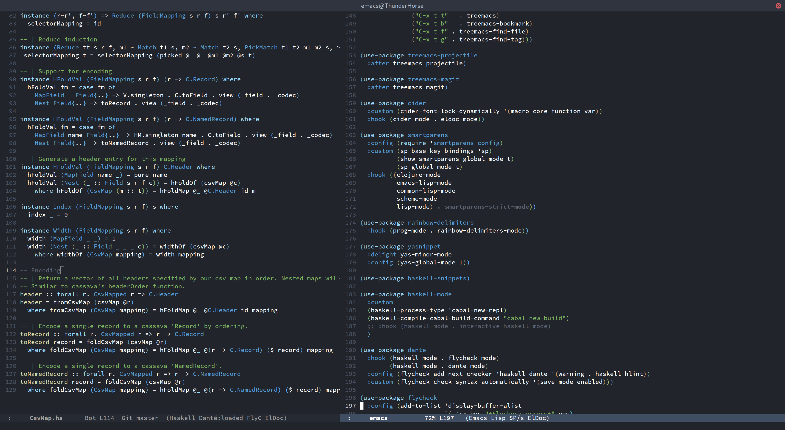

# arc-dark-theme
Arc dark theme for Emacs, to match the Gtk theme.
Based off [jonathanchu/atom-one-dark-theme](https://github.com/jonathanchu/atom-one-dark-theme) and colors matching [VSCode Arc+ theme](https://marketplace.visualstudio.com/items?itemName=ph-hawkins.arc-plus)

Has only been tested against haskell-mode so far.

## Usage
This theme is not yet on MELPA. Until then:

- You can place the arc-dark-theme in ~./emacs.d and add `(load-theme 'arc-dark t)` to your .emacs
- Or it can be used with straight.el, with a section in your init file like so:

```elisp
(use-package arc-dark-theme
  :straight (:host github :repo "cfraz89/arc-dark-theme")
  :config (load-theme 'arc-dark t))
```


